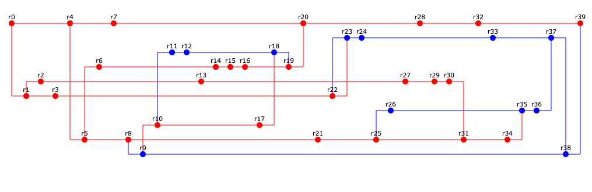

# Основы программной инженерии
## Лабораторная работа №2

**Вариант 391099**
Сконфигурировать в своём домашнем каталоге репозитории svn и git и загрузить в них начальную ревизию файлов с исходными кодами (в соответствии с выданным вариантом).

Воспроизвести последовательность команд для систем контроля версий svn и git, осуществляющих операции над исходным кодом, приведённые на блок-схеме.

При составлении последовательности команд необходимо учитывать следующие условия:
- Цвет элементов схемы указывает на пользователя, совершившего действие (красный - первый, синий - второй).
- Цифры над узлами - номер ревизии. Ревизии создаются последовательно.
- Необходимо разрешать конфликты между версиями, если они возникают.

**Отчёт по работе должен содержать:**
1. Задание и блок-схему в соответствии с вариантом.
2. 2. Номера ревизий и соответствующие им последовательности команд с комментариями (для svn и git).
3. Выводы по работе.

**Вопросы к защите лабораторной работы:**
1. Системы контроля версий - назначение, примеры решений.
2. Ревизии и ветки.
3. Основные операции над данными в системах контроля версий. Основные команды svn и git.
4. Виды конфликтов и способы их решения.

